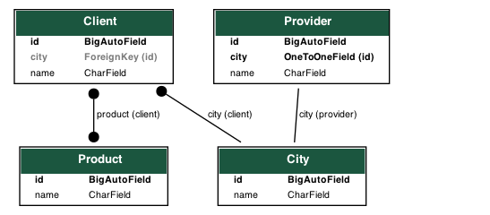
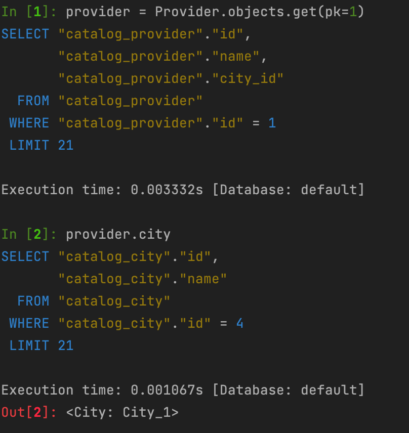
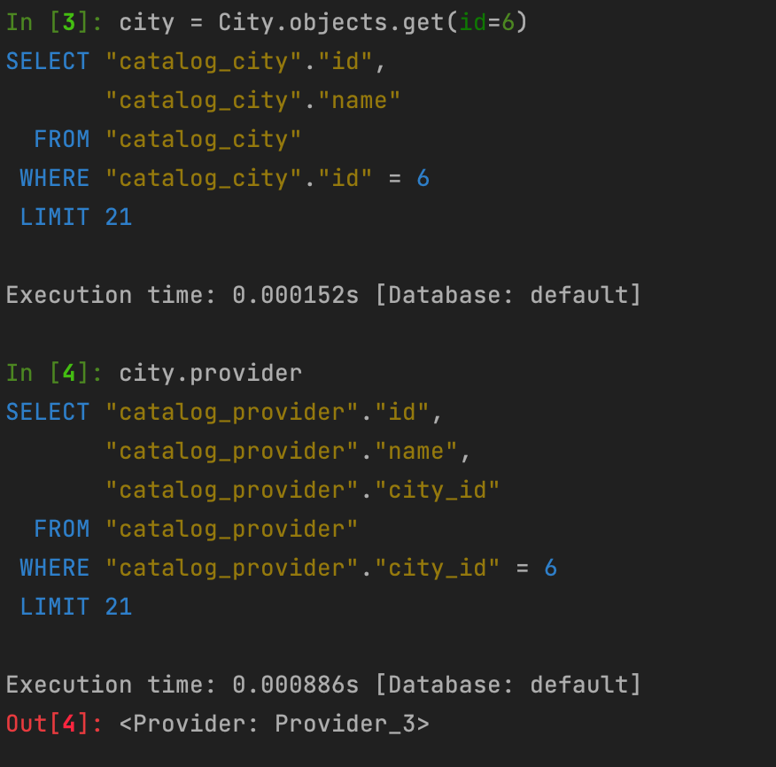
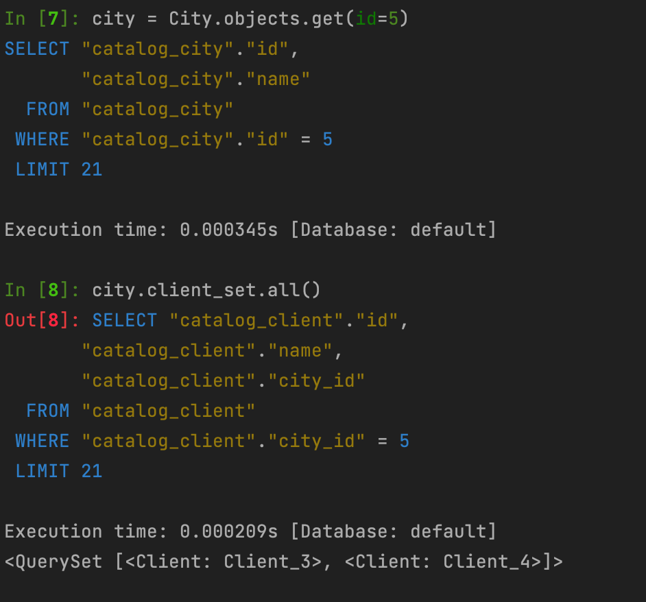
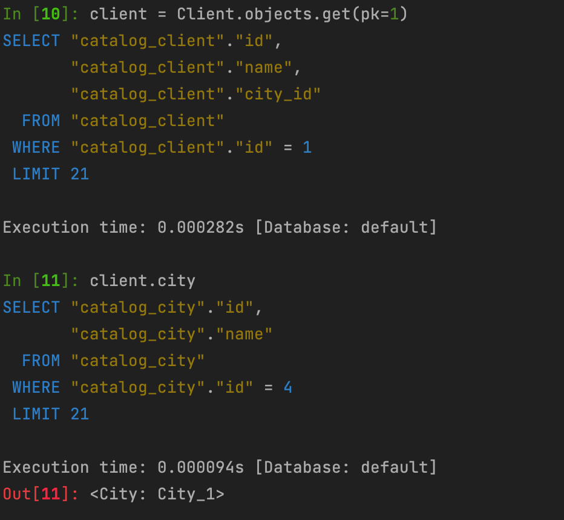
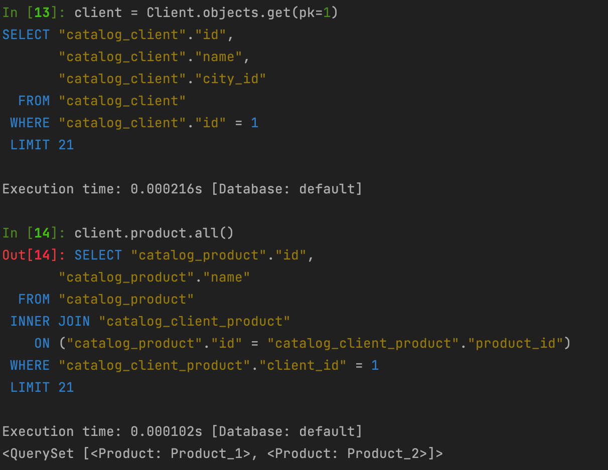
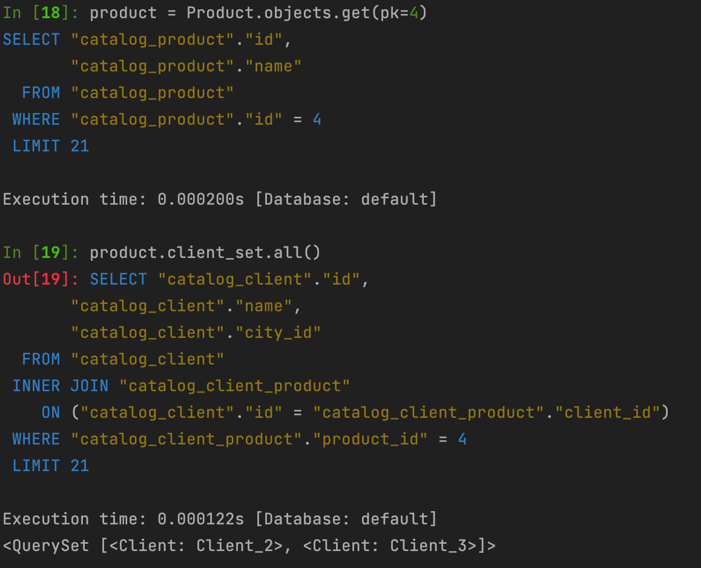

# hillel_hw_8
## Description
Implement models in the application that use OneToOneField, ForeignKey, ManyToManyField fields.
Use graph_models from django-extensions to display the model structure of ONLY this application.

--------

## Launch
* clone current repository
* pip install -r requirements.txt
* python manage.py makemigrations
* python manage.py migrate
* python manage.py loaddata db.json
* python manage.py shell_plus --print-sql
* Test db with django orm

--------

## Realized

1. Created tables City,Provider,Client,Product
2. Get provider's city
3. Get city's provider
4. Get city's clients
5. Get client's city
6. Get client's products
7. Get product's clients